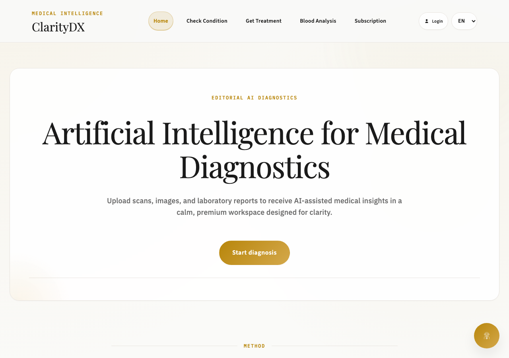
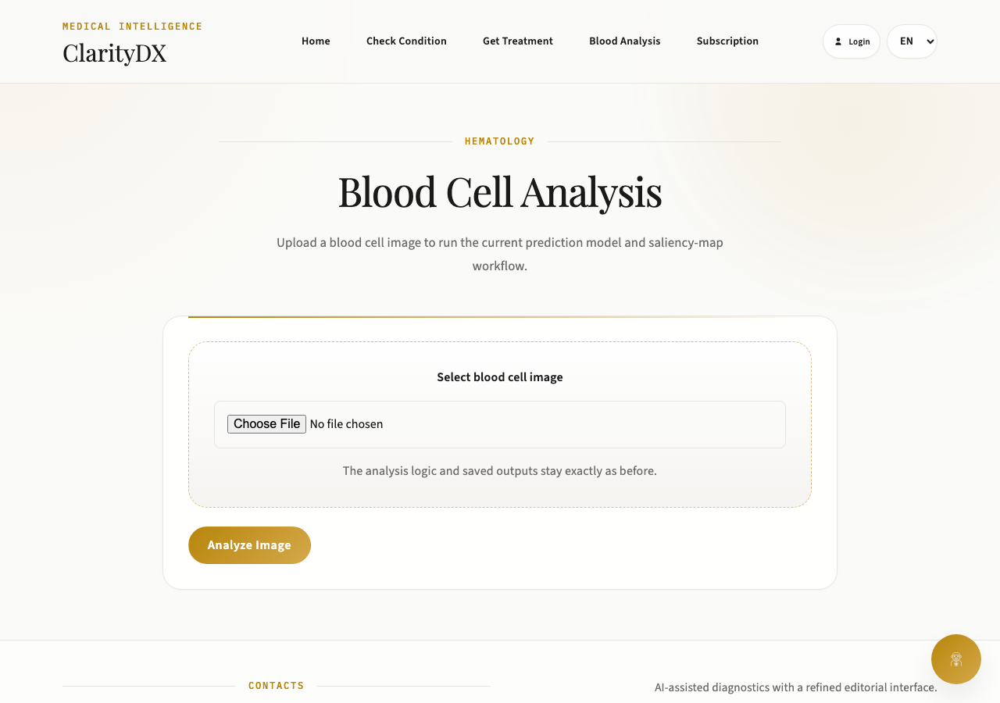
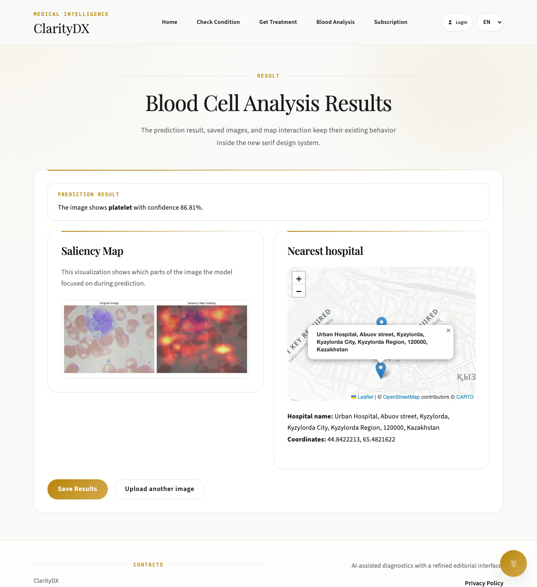
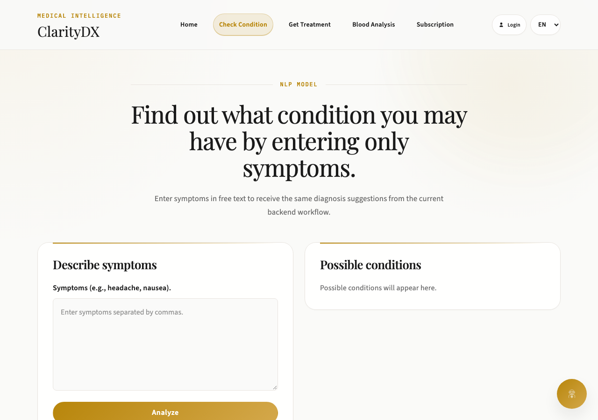
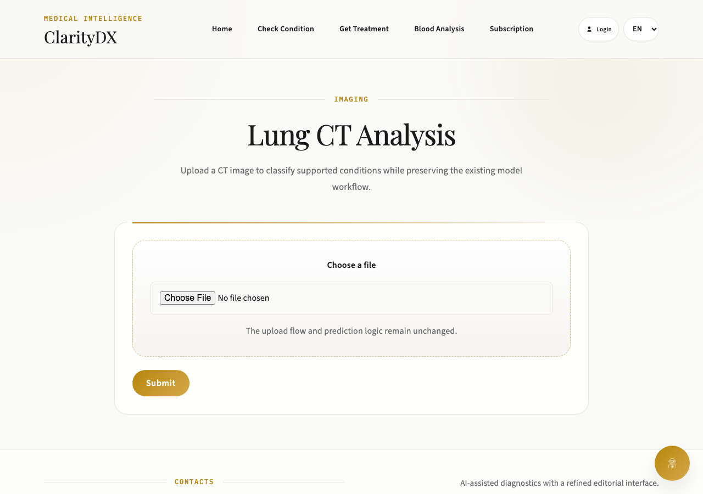
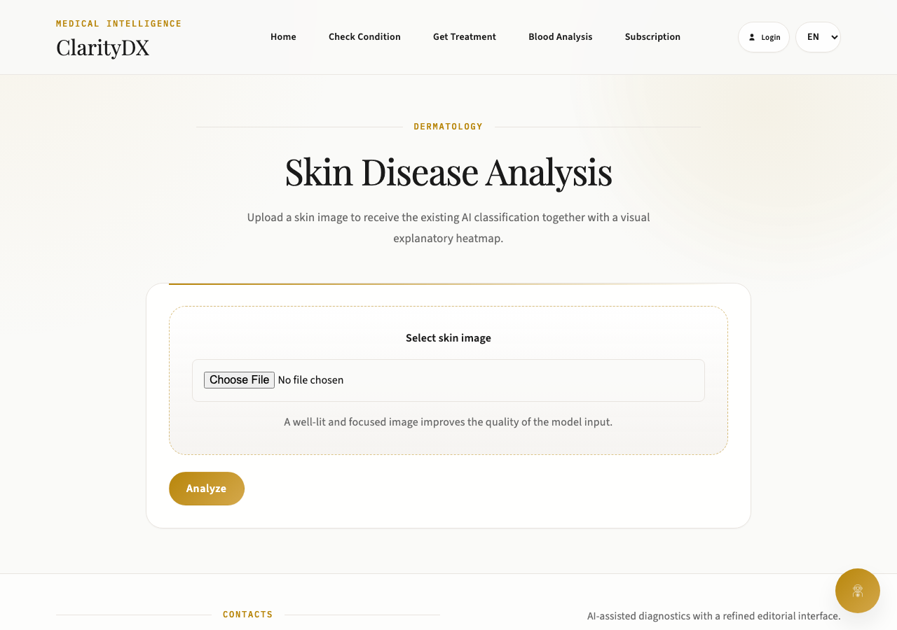

# ClarityDX (HealthX)

**AI-powered medical diagnostics platform** built with Django and a suite of deep-learning models for blood cell classification, lung CT screening, skin condition detection, symptom triage, and automated medical report parsing.


> ⚠️ **Medical disclaimer.** This project was built for educational and portfolio purposes. It is **not** a certified medical device and must never be used for real diagnosis or treatment decisions. Always consult a qualified healthcare professional.

---

## Demo

| Home | Blood Cell Analysis | Blood Cell Result |
|---|---|---|
|  |  |  |

| Symptom Check (NLP) | Lung CT Upload | Skin Analysis |
|---|---|---|
|  |  |  |

The **Blood Cell Analysis** result above is a real prediction from the bundled model (`platelet`, 86.8% confidence), including its saliency-map visualization and the nearest-hospital lookup.

---

## Features

| Module | Endpoint | Model | Status |
|---|---|---|---|
| Blood Cell Classification | `/upload_cellblood/` | Custom CNN (8 cell types), Keras | ✅ Working, saliency-map explainability |
| Lung CT Screening | `/upload2/` | VGG16-based classifier, 4 classes (adenocarcinoma, large cell carcinoma, squamous cell carcinoma, normal) | ✅ Working |
| Skin Condition Detection | `/skin/` | EfficientNet-B4 (torchvision), Grad-CAM | ✅ Working |
| Symptom Triage (NLP) | `/analyze/` | OpenAI-backed free-text symptom analysis | ✅ Working (requires `OPENAI_API_KEY`) |
| Treatment Lookup | `/recovery/` | Database-backed condition → treatment lookup | ✅ Working |
| Medicine Recommendation | `/recommendation/` | scikit-learn SVC over a symptom/disease dataset | ✅ Working |
| Blood Report OCR | `/bloodanalysis/` | pytesseract + pdfplumber, chart generation | ✅ Working |
| AI Chatbot | `/chatbot_api/` | OpenAI GPT | ✅ Working (requires `OPENAI_API_KEY`) |
| Subscriptions | `/subscription/` | Stripe Checkout | ✅ Working (requires Stripe keys) |
| Lung X-ray Analysis | `/upload/` | ⚠️ See [Known limitations](#known-limitations) | ⚠️ Known issue |

## Tech stack

- **Backend:** Django 5.1, Django REST Framework, Gunicorn
- **ML/DL:** TensorFlow / Keras, PyTorch, torchvision, scikit-learn, OpenCV, Grad-CAM
- **Data & documents:** pandas, pdfplumber, pytesseract, fpdf2, Plotly
- **Integrations:** OpenAI API, Stripe, Deep Translator, OpenStreetMap/Leaflet
- **Infra:** Docker, Docker Compose, PostgreSQL (SQLite for local dev), WhiteNoise for static files

## Quick start (Docker — recommended)

This is the fastest way to run the full stack (app + PostgreSQL) with zero local Python setup.

```bash
git clone https://github.com/Alishnis/claritydx.git
cd claritydx/mysite
cp env.example .env        # then fill in OPENAI_API_KEY / Stripe keys as needed
docker compose up --build
```

The app will be available at **http://localhost:8000**. The first build downloads and bakes in the ML model backbones, so it can take several minutes; subsequent builds are cached.

To create an admin account inside the container:

```bash
docker compose exec web python manage.py createsuperuser
```

## Manual setup (without Docker)

Prerequisites: Python 3.12+, [Tesseract OCR](https://github.com/tesseract-ocr/tesseract) installed locally.

```bash
git clone https://github.com/Alishnis/claritydx.git
cd claritydx/mysite

python -m venv venv
source venv/bin/activate   # Windows: venv\Scripts\activate

pip install -r requirements.txt

cp env.example .env        # fill in your keys; leave POSTGRES_* unset to use SQLite

python manage.py migrate
python manage.py createsuperuser
python manage.py runserver 127.0.0.1:8000
```

> This repository uses [Git LFS](https://git-lfs.com/) to store the trained model weight files (`trained_model.h5`, `vgg16.weights.h5`, `model_from_scratch_blood.weights.h5`). Install `git-lfs` and run `git lfs pull` if the models don't load after cloning.

## Environment variables

See [`mysite/env.example`](mysite/env.example) for the full list. Summary:

| Variable | Required | Purpose |
|---|---|---|
| `SECRET_KEY` | Recommended | Django secret key |
| `DEBUG` | No (default `True`) | Django debug mode |
| `ALLOWED_HOSTS` | No | Comma-separated allowed hosts |
| `OPENAI_API_KEY` | For chatbot & symptom NLP | OpenAI API access |
| `STRIPE_SECRET_KEY` / `STRIPE_PUBLISHABLE_KEY` | For subscriptions | Stripe payment processing |
| `POSTGRES_HOST` / `POSTGRES_DB` / `POSTGRES_USER` / `POSTGRES_PASSWORD` / `POSTGRES_PORT` | No | Switches the database from SQLite to PostgreSQL (set automatically by `docker-compose.yml`) |

## Project structure

```
claritydx/
├── docs/screenshots/         # README demo images
├── LICENSE
└── mysite/                   # Django project root
    ├── manage.py
    ├── Dockerfile
    ├── docker-compose.yml
    ├── requirements.txt
    ├── env.example
    ├── mysite/                # Django settings, URLs, WSGI/ASGI
    └── myapp/                 # Application logic
        ├── views.py           # Lung CT / X-ray, symptom analysis, chatbot, subscriptions
        ├── views2.py          # Skin analysis
        ├── views3_for_models.py  # Blood cell classification, medicine recommendation
        ├── auth_views.py      # Registration/login
        ├── blood_ml_model.py  # Blood cell model loader
        ├── inference.py       # Grad-CAM inference helper
        ├── templates/         # HTML templates
        ├── static/            # App static assets
        └── recommendation system/  # Symptom → medicine recommendation dataset & model
```

## Known limitations

- **Lung X-ray Analysis (`/upload/`) does not perform real chest X-ray classification.** It currently reuses the lung-CT model's output and labels it with an unrelated 14-class NIH ChestX-ray14 disease list, so the returned disease name/confidence is not medically meaningful. The intended VGG16 X-ray model/weights referenced in `inference.py` were never wired into a URL and their weight file is a duplicate of the blood-cell model's weights. Use **Lung CT Analysis** for a correctly matched model/label pipeline. This is left in place for transparency rather than silently removed; contributions fixing it are welcome.
- The skin-analysis and Grad-CAM backbones (EfficientNet-B4, DenseNet121) download their pretrained ImageNet weights from `download.pytorch.org` the first time they're used; the Docker image pre-downloads them at build time so this isn't an issue in containers, but a from-scratch local `venv` setup needs outbound internet access on first run.
- Model accuracy figures in this README describe the original training runs, not a guarantee for arbitrary input images.

## License

MIT — see [LICENSE](LICENSE).
