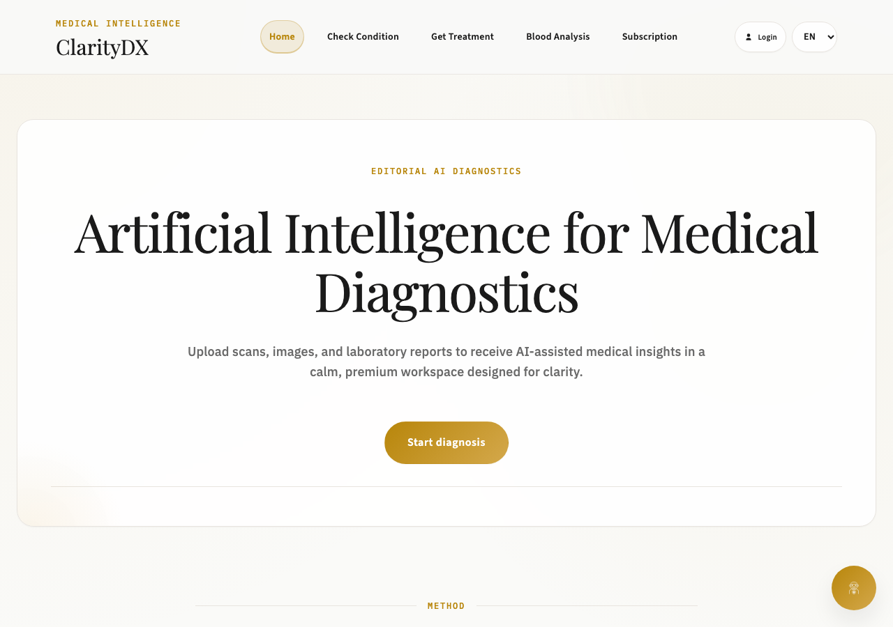
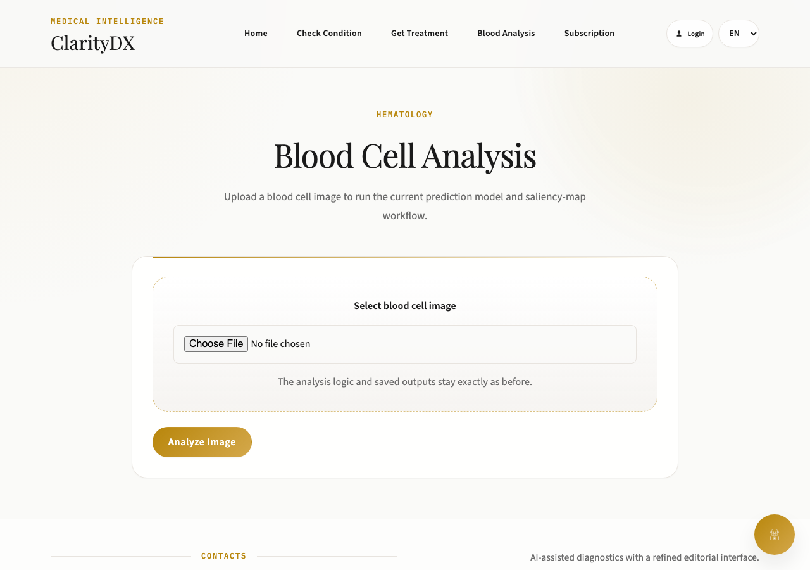
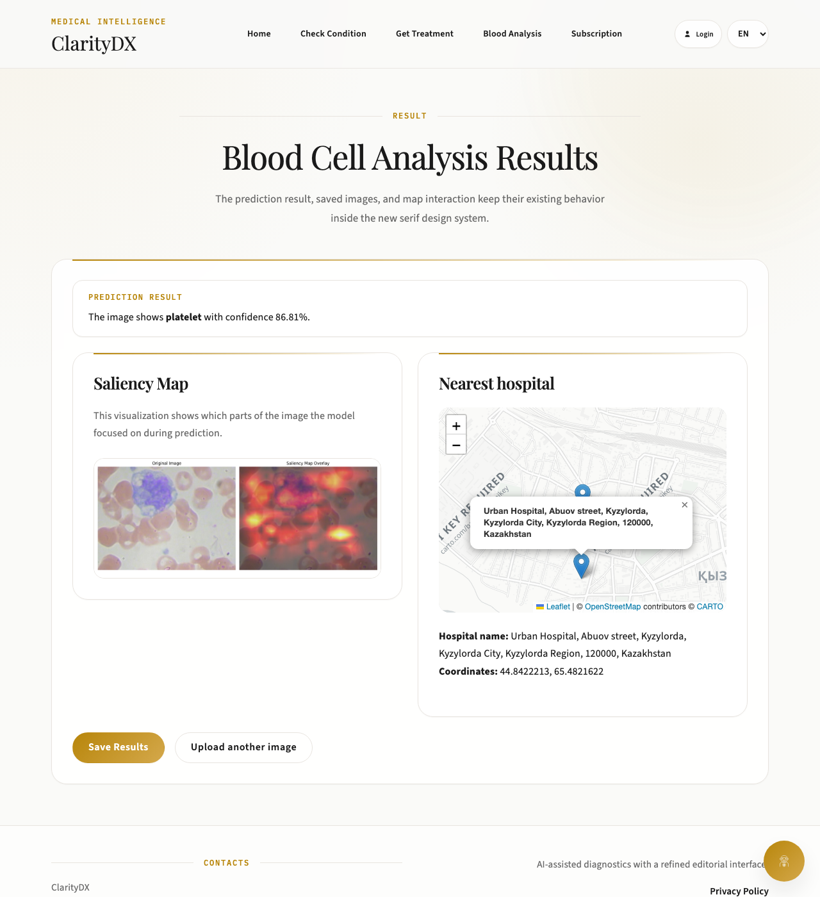
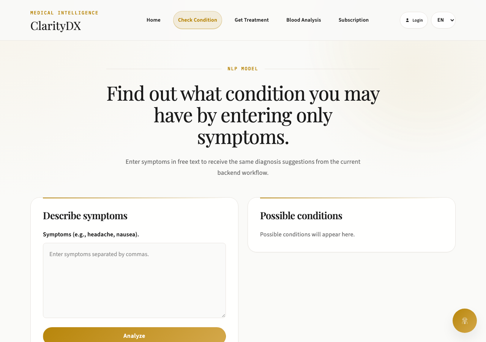
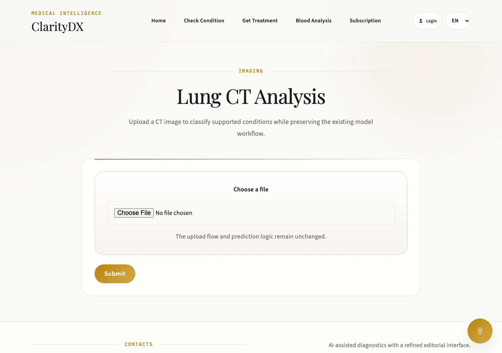
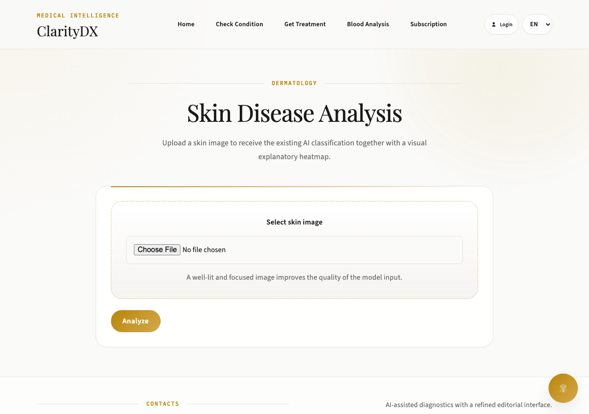

# ClarityDX (HealthX)

A Django web app that bundles several medical-imaging and symptom tools (blood cell classification, lung CT screening, skin lesion demo, symptom lookup, blood-report OCR, AI chatbot) behind one UI, with English and Russian interfaces.

[](https://github.com/Alishnis/claritydx/actions/workflows/ci.yml)


> **Medical disclaimer.** This project was built for educational and portfolio purposes. It is **not** a certified medical device and must never be used for real diagnosis or treatment decisions. Always consult a qualified healthcare professional. Several modules are prototypes whose output is not medically meaningful (see [Known limitations](#known-limitations)).

## Demo

[](https://youtu.be/e7lqUNRr8Vo)

Full walkthrough: Lung X-ray analysis with Grad-CAM, saved analysis history, CT screening, blood cell classification with saliency maps, blood report OCR with AI recommendations, symptom lookup, and the AI chatbot.

| Home | Blood Cell Analysis | Blood Cell Result |
|---|---|---|
|  |  |  |

| Symptom Check | Lung CT Upload | Skin Analysis |
|---|---|---|
|  |  |  |

The **Blood Cell Analysis** result above is a real prediction from the bundled model (`platelet`, 86.8% confidence), including its saliency-map visualization and the nearest-hospital lookup.

There is no hosted live demo. <!-- TODO(owner): add a live URL here if you deploy one. -->

## Features

| Module | Endpoint | Implementation | Status |
|---|---|---|---|
| Blood cell classification | `/upload_cellblood/` | Custom Keras CNN, 8 cell types, saliency-map explainability | Working (not quantitatively evaluated) |
| Lung CT screening | `/upload2/` | VGG16-based Keras classifier, 4 classes (adenocarcinoma, large cell carcinoma, squamous cell carcinoma, normal) | Working, see [Evaluation](#evaluation) |
| Skin condition detection | `/skin/` | torchvision EfficientNet-B4 with a new 7-class head and Grad-CAM | Demo only: no trained skin weights are included, so predictions are not meaningful |
| Symptom analysis | `/analyze/` | Free-text symptoms (auto-translated with `deep-translator`) fed to `microsoft/BioGPT` through `myapp/ex.py`; downloads the model from Hugging Face on first use | Prototype: raw generative text, unreliable |
| Medicine recommendation | `/recommendation/` | scikit-learn SVC over a symptom/disease dataset (`recommendation system/`) | Working |
| Treatment lookup | `/recovery/` | Database lookup of the `Disease` model | Empty by default: add entries in the Django admin |
| Blood report OCR | `/bloodanalysis/` | pytesseract + pdfplumber, Plotly charts, AI recommendations via `/get_ai_recommendations/` | Working (AI part needs `OPENAI_API_KEY`) |
| AI chatbot | `/chatbot_api/` | OpenAI SDK pointed at OpenRouter by default (`meta-llama/llama-3.1-8b-instruct`) | Working (needs `OPENAI_API_KEY`) |
| Subscriptions | `/subscription/` | Stripe Checkout | Implemented; needs Stripe keys, not covered by tests |
| Lung X-ray analysis | `/upload/` | Reuses the CT model with an unrelated label set | Known issue, see [Known limitations](#known-limitations) |
| Accounts and history | `/register/`, `/login/`, `/kab/` | Django auth, per-user saved analyses | Working (covered by tests) |

## Architecture

```
Browser (Django templates, English / Russian)
   |
   v
Django 5.1 (mysite/urls.py -> myapp/urls.py)
   |-- views.py            lung CT / X-ray, symptom analysis, blood report OCR, chatbot, Stripe
   |-- views2.py           skin analysis, saved-analysis API, blood-analysis graphs
   |-- views3_for_models.py  blood cell classification, medicine recommendation
   |
   |-- Keras / TensorFlow  trained_model.h5 (CT), vgg16.weights.h5 (blood cell)        [Git LFS]
   |-- PyTorch             EfficientNet-B4 (skin), DenseNet121 (X-ray), Grad-CAM
   |-- scikit-learn        recommendation system/models/svc.pkl                         [Git LFS]
   |-- Transformers        microsoft/BioGPT via subprocess (myapp/ex.py)
   |-- OpenAI-compatible API (OpenRouter) and Stripe over HTTPS
   v
SQLite (default) or PostgreSQL (when POSTGRES_HOST is set); uploads in media/
```

## Tech stack

- **Backend:** Django 5.1, Django REST Framework, Gunicorn, WhiteNoise
- **ML/DL:** TensorFlow / Keras, PyTorch, torchvision, scikit-learn, OpenCV, Grad-CAM, Transformers
- **Data and documents:** pandas, pdfplumber, pytesseract, fpdf2, Plotly
- **Integrations:** OpenAI SDK (OpenRouter by default), Stripe, Deep Translator, Leaflet map
- **Infra:** Docker, Docker Compose, PostgreSQL (SQLite for local dev), GitHub Actions CI

## Quick start

The trained models are stored with **Git LFS**. Install it *before* cloning (see [Model files (Git LFS)](#model-files-git-lfs)); otherwise the app fails to start.

### Docker (app + PostgreSQL)

```bash
git lfs install
git clone https://github.com/Alishnis/claritydx.git
cd claritydx/mysite
cp env.example .env        # then fill in OPENAI_API_KEY / Stripe keys as needed
docker compose up --build
```

The app is served at **http://localhost:8000**. The first build downloads and bakes in the torchvision backbones (DenseNet121, EfficientNet-B4), so it can take several minutes. Create an admin account with:

```bash
docker compose exec web python manage.py createsuperuser
```

### Local (without Docker)

Prerequisites: Python 3.12, [Tesseract OCR](https://github.com/tesseract-ocr/tesseract), and Git LFS.

```bash
git lfs install
git clone https://github.com/Alishnis/claritydx.git
cd claritydx/mysite        # run everything from this directory: model paths are relative to it

python -m venv venv
source venv/bin/activate   # Windows: venv\Scripts\activate
pip install -r requirements.txt

cp env.example .env        # fill in your keys; leave POSTGRES_* unset to use SQLite

python manage.py migrate
python manage.py createsuperuser
python manage.py runserver 127.0.0.1:8000
```

Notes: `requirements.txt` pins TensorFlow 2.18 and PyTorch 2.6, so the install is large. The Docker path is not exercised by CI.

## Model files (Git LFS)

`.gitattributes` routes these patterns to Git LFS: `*.h5`, `*.weights.h5` and `mysite/myapp/recommendation system/models/*.pkl`. The files actually tracked through LFS (`git lfs ls-files`):

| File | Size | Used by |
|---|---|---|
| `mysite/trained_model.h5` | 67 MB | Lung CT classifier, loaded at server start (`views.py`; path is relative to `mysite/`) |
| `mysite/myapp/vgg16.weights.h5` | 11 MB | Blood cell classifier at `/upload_cellblood/` (`inference.py`) |
| `mysite/myapp/model_from_scratch_blood.weights.h5` | 11 MB | Same LFS object as `vgg16.weights.h5`; only referenced by the unused `blood_ml_model.py` |
| `mysite/myapp/recommendation system/models/svc.pkl` | 389 KB | Medicine recommendation, loaded at server start (`views3_for_models.py`) |

Unique download is about 78 MB (the two `.h5` weight entries are one shared object).

Set up:

```bash
git lfs install            # once per machine
git lfs pull               # in an existing clone, fetches the files above
git lfs ls-files           # a leading "*" means the real file is present, "-" means only a pointer
```

If the files are missing or are still ~130-byte LFS pointer text files (for example you cloned without `git-lfs`, or downloaded a ZIP from GitHub), the app does **not** degrade gracefully: `trained_model.h5` and `svc.pkl` are loaded when the server starts, so it fails at import with a model/unpickling error, and `/upload_cellblood/` fails when its weights cannot be read. Fix it with `git lfs pull`. Docker builds copy the working tree, so run `git lfs pull` before `docker compose build` too.

## Configuration

Copy [`mysite/env.example`](mysite/env.example) to `mysite/.env` (git-ignored). Real environment variables take precedence over `.env`.

| Variable | Default | Purpose |
|---|---|---|
| `SECRET_KEY` | insecure dev value | Django secret key. Always set your own outside local development |
| `DEBUG` | `True` | Django debug mode. Set `False` in production |
| `ALLOWED_HOSTS` | `127.0.0.1,localhost` | Comma-separated allowed hosts |
| `OPENAI_API_KEY` | none | Key for the chatbot and AI recommendations (an OpenRouter key by default) |
| `OPENAI_BASE_URL` | `https://openrouter.ai/api/v1` | API endpoint; use `https://api.openai.com/v1` for OpenAI directly |
| `OPENAI_MODEL` | `meta-llama/llama-3.1-8b-instruct` | Model name sent to the API |
| `STRIPE_SECRET_KEY` / `STRIPE_PUBLISHABLE_KEY` | empty | Stripe Checkout for subscriptions |
| `POSTGRES_HOST` / `POSTGRES_DB` / `POSTGRES_USER` / `POSTGRES_PASSWORD` / `POSTGRES_PORT` | unset (SQLite) | Setting `POSTGRES_HOST` switches to PostgreSQL (set automatically by `docker-compose.yml`) |
| `WEB_PORT` | `8000` | docker-compose only: published host port |

## Project structure

```
claritydx/
├── .github/workflows/ci.yml   # migrations check + test suite
├── docs/screenshots/          # README images
├── LICENSE
└── mysite/                    # Django project root (run commands from here)
    ├── manage.py
    ├── Dockerfile, docker-compose.yml, docker-entrypoint.sh
    ├── requirements.txt, env.example
    ├── train_ct_model.py      # retrain the CT classifier
    ├── evaluate_ct_model.py   # evaluate it on a labeled test folder
    ├── trained_model.h5       # CT model (Git LFS)
    ├── mysite/                # settings, URLs, WSGI/ASGI
    └── myapp/
        ├── views.py           # CT / X-ray, symptom analysis, blood OCR, chatbot, Stripe
        ├── views2.py          # skin analysis, analysis API, graphs
        ├── views3_for_models.py   # blood cell classification, medicine recommendation
        ├── auth_views.py      # registration / login / dashboard
        ├── inference.py       # blood cell model loading and saliency maps
        ├── ex.py              # BioGPT symptom analysis (run as a subprocess)
        ├── models.py, migrations/, templates/, static/, templatetags/
        ├── tests.py           # test suite
        └── recommendation system/  # vendored symptom -> medicine dataset and SVC model
```

## Testing

```bash
cd mysite
python manage.py test myapp
```

The suite has 26 tests covering public pages, auth, the dashboard (per-user isolation), CT upload (mocked model, including a regression test for stored file paths), the skin-analysis confidence value (mocked model), the treatment lookup, the blood-analysis API and the AI chatbot (mocked LLM client, language selection). It needs the LFS model files and the full `requirements.txt` installed, because the models load at import time. GitHub Actions runs the tests plus `makemigrations --check` on every push and pull request (`.github/workflows/ci.yml`, Python 3.12, with Tesseract and the CPU PyTorch index).

## Evaluation

Only the **Lung CT classifier** had a labeled held-out test set available (kept out of the repo because of its size), so it is the one model evaluated quantitatively. Metrics below were measured on **314 test images** kept separate from the train/valid folders (VGG16 transfer-learning classifier, 128×128 input; the accompanying training split contains 613 images).

| Class | Precision | Recall | F1 | Support |
|---|---|---|---|---|
| Adenocarcinoma | 0.710 | 0.555 | 0.623 | 119 |
| Large cell carcinoma | 0.398 | 0.922 | 0.556 | 51 |
| Normal | 1.000 | 0.981 | 0.991 | 54 |
| Squamous cell carcinoma | 0.740 | 0.411 | 0.529 | 90 |
| **Overall accuracy** | | | **0.646** | **314** |
| **Macro avg** | 0.712 | 0.717 | 0.675 | 314 |

Confusion matrix (rows = true class, columns = predicted):

| True \ Pred | Adeno | Large cell | Normal | Squamous |
|---|---|---|---|---|
| **Adenocarcinoma** | 66 | 40 | 0 | 13 |
| **Large cell** | 4 | 47 | 0 | 0 |
| **Normal** | 0 | 1 | 53 | 0 |
| **Squamous cell** | 23 | 30 | 0 | 37 |

**Reading the numbers:** the model separates *normal* scans from cancerous ones almost perfectly (98% recall, no false "normal" predictions on cancer scans) and rarely misses large cell carcinoma (92% recall), but it over-predicts large cell and misses many squamous cases (41% recall). The model was retrained with data augmentation, class weighting and two-phase fine-tuning (`train_ct_model.py`); this lifted accuracy from 56.4% to 64.6% over the first version, with model selection done on the validation split only. The remaining gap is likely due to the very small training set (613 images) and a distribution shift between the train and test splits. This is a transfer-learning prototype, not a clinical-grade classifier.

Reproduce (from `mysite/`, after placing your own test images in `data/test/<class>/`, one folder per class):

```bash
python evaluate_ct_model.py data/test
```

To retrain: `python train_ct_model.py data trained_model.h5` (expects `data/train` and `data/valid`).

| Module | Evaluated? | Why not |
|---|---|---|
| Lung CT | ✅ Above | — |
| Blood cell classification | ❌ | No labeled test set is bundled with the repo |
| Skin analysis | ❌ | No labeled test set is bundled with the repo |
| Lung X-ray | ❌ | See [Known limitations](#known-limitations) |

## Known limitations

- **Not a medical tool.** Nothing here is validated for clinical use; see the disclaimer at the top.
- **Lung X-ray Analysis (`/upload/`) does not perform real chest X-ray classification.** It currently reuses the lung-CT model's output and labels it with an unrelated 14-class NIH ChestX-ray14 disease list, so the returned disease name/confidence is not medically meaningful. The intended VGG16 X-ray model/weights referenced in `inference.py` were never wired into a URL and their weight file is a duplicate of the blood-cell model's weights. Use **Lung CT Analysis** for a correctly matched model/label pipeline. This is left in place for transparency rather than silently removed; contributions fixing it are welcome.
- **Skin analysis has no trained weights.** `views2.py` builds an ImageNet-pretrained EfficientNet-B4 and attaches a freshly initialised 7-class head; no skin checkpoint is loaded anywhere, so the class and confidence shown are not meaningful.
- **Symptom analysis (`/analyze/`)** is untuned `microsoft/BioGPT` text generation. It needs outbound internet on first use (Hugging Face download, Google Translate for non-English input) and returns unreliable text.
- **Treatment lookup** returns "information unavailable" until `Disease` rows are added through the admin; no seed data is included.
- **Models load at server start**, so missing LFS files stop the whole app (see [Model files (Git LFS)](#model-files-git-lfs)). Pretrained torchvision backbones (EfficientNet-B4, DenseNet121) download from `download.pytorch.org` on first use; the Docker image pre-downloads them, a local setup needs internet on first run (if the download fails the code falls back to randomly initialised weights).
- Blood cell and skin modules have no labeled test set, so they are not evaluated; the [Evaluation](#evaluation) figures come from a small held-out CT test split and are not a guarantee for arbitrary real-world scans.
- Defaults are development-oriented (`DEBUG=True`, insecure `SECRET_KEY` fallback); set both explicitly for any deployment. Some user-facing messages are in Russian only.

## Author's role

<!-- TODO(owner): describe what you built yourself vs. what is adapted (e.g. the vendored "recommendation system" sub-project, public datasets and pretrained models), your role, and the timeline/team. -->

## License

MIT, see [LICENSE](LICENSE).
